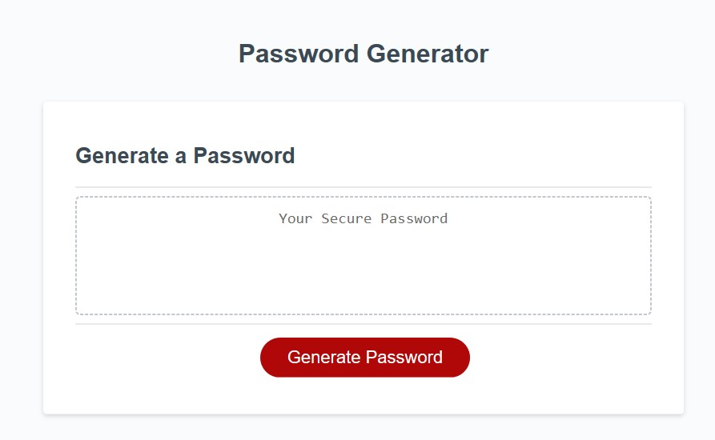
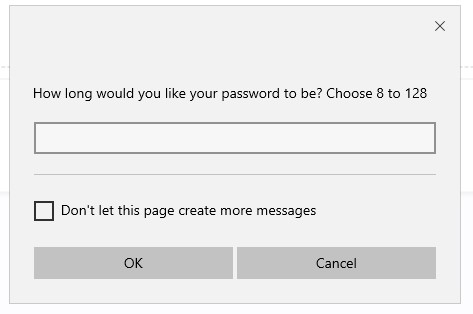
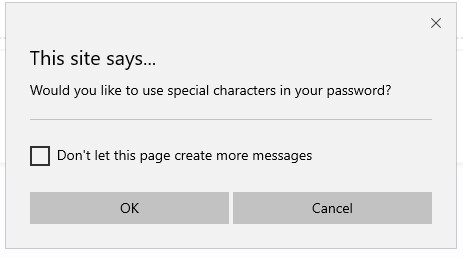
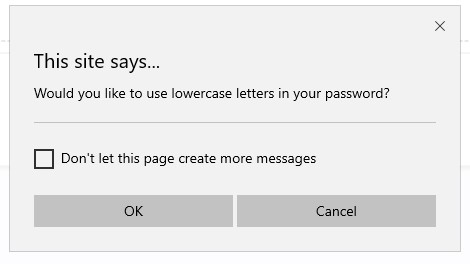

# Password Generator Starter Code

Acceptance Criteria:

GIVEN I need a new, secure password
WHEN I click the button to generate a password
THEN I am presented with a series of prompts for password criteria
WHEN prompted for password criteria
THEN I select which criteria to include in the password
WHEN prompted for the length of the password
THEN I choose a length of at least 8 characters and no more than 128 characters
WHEN prompted for character types to include in the password
THEN I choose lowercase, uppercase, numeric, and/or special characters
WHEN I answer each prompt
THEN my input should be validated and at least one character type should be selected
WHEN all prompts are answered
THEN a password is generated that matches the selected criteria
WHEN the password is generated
THEN the password is either displayed in an alert or written to the page

Sample screenshot of the from the password generator challenge:

REPOSITORY TITLE: lafry5/Password_Generator
    
    Copied starter code from coding-boot-camp/friendly-parakeet. Updated the script.js file.

Repository Link: https://github.com/lafry5/Password_Generator

Github Page: https://lafry5.github.io/Password_Generator/

TABLE OF CONTENTS:
    
    -  Clone
 
    -  Setup
 
    -  Contributing

    -  Description
 
    -  Support

Clone:
    Clone this repo to your local machine using https://lafry5.github.io/Password_Generator/
    

Setup:
    Ensure that all files are located in the root folder (Index, Readme file, screenshot, script and and style).

Contributing:
    Starter code was provided for this assignment from coding-boot-camp/friendly-parakeet.

Description:
    This code will create a work day schedule for the current day (from 9am - 5pm). The schedule is color coded as follows: hours in the past are grey, the current hour is red, and hours in the future are green. The code will allow an input next to each hour from the user. If the user pushes the save button next to an input it will persist; if not the input will not be saved.  

    Examples screenshots are as follows:

 
Support:
    Reach out to me at one of the following places if you have any questions!

    Email: lafry5@yahoo.com 
    Cell: (602) 363-0253
     